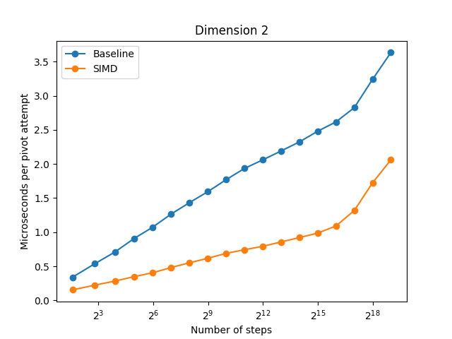

# pivot-simd

A SIMD-accelerated implementation of [pivot](https://github.com/bencwallace/pivot).
To my knowledge, this is the first and only such implementation.
Currently only supports dimension 2.

## Benchmarks

The semi-log plot below compares the runtime (in microseconds) per pivot attempt of the baseline and SIMD-optimized versions of the algorithm.

These results below were obtained via the `pivot` [benchmark script](https://github.com/bencwallace/pivot/blob/master/scripts/benchmark.py). The raw data can be found in [bench.csv](./assets/bench.csv). Relevant system specifications are available in [specs](assets/specs).
